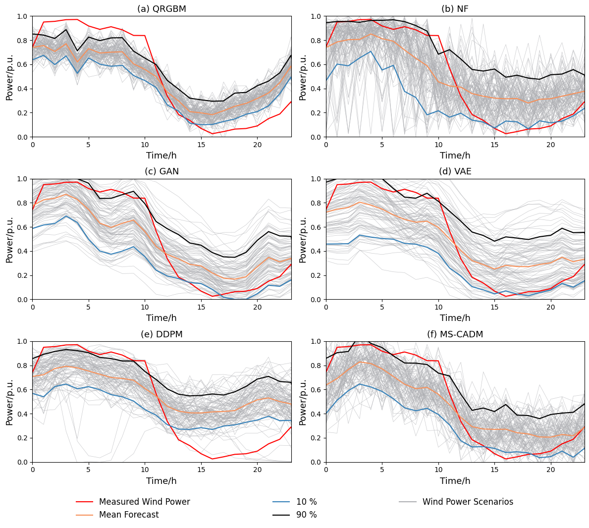
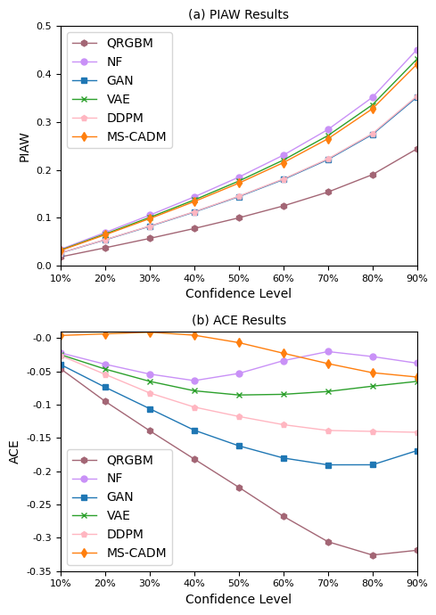
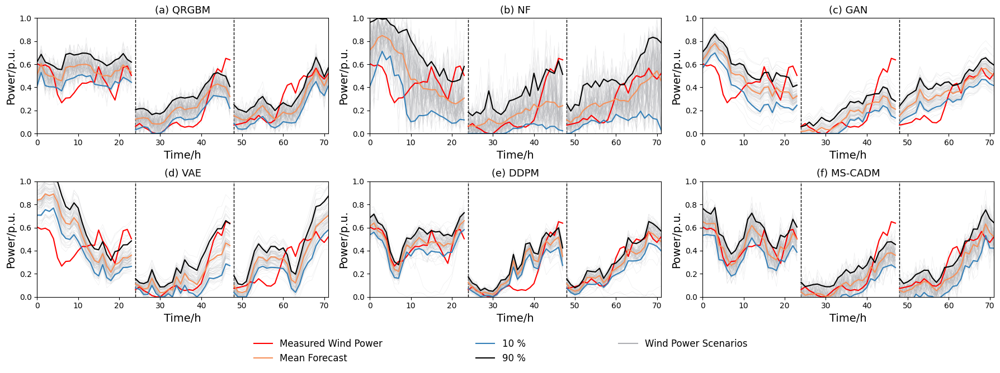

# CDiT: Conditional Diffusion Transformer For Wind Power Scenario Generation

---

This repository implements a novel generative framework, **Conditional Diffusion Transformer (CDiT)**, designed for wind power scenario generation. The framework leverages the powerful generative capabilities of Diffusion Transformers to model the uncertainty and intermittency of wind power output, addressing the challenges posed by large-scale wind power integration into power systems.  

CDiT outperforms traditional deep learning generative models, such as Generative Adversarial Networks (GANs), Variational Autoencoders (VAEs), and Normalizing Flows, by utilizing a Transformer-based backbone for diffusion models. The framework is evaluated on the wind power dataset from the Global Energy Forecasting Competition 2014, demonstrating state-of-the-art performance in generating realistic and diverse wind power scenarios. 








---

## Requirements
To create and activate a suitable [conda](https://conda.io/) environment named `CDiT`, follow these steps:

```
conda env create -f environment.yaml
conda activate CDiT
```

## Train

To train CDiT on wind power scenario generation, run the following command:

```sh
python train.py \
  --model="DiT-S/1" \
  --data_path="./data/wind_data_all_zone.csv" \
  --results_dir="./results/wind" \
  --seq_len=24 \
  --global_batch_size=256 \
  --max_train_steps=26_000 \
  --ckpt_every=1000 \
  --log_every=500 \
```

## Scenario Generation

To generate wind power scenarios using a trained CDiT model, run the following command:

```sh
python sample_ddp.py \
  --model="DiT-S/1" \
  --data_path="./data/wind_data_all_zone.csv" \
  --seq_len=24 \
  --seed=3470 \
  --num_sampling_steps=50 \
  --ckpt="your_model.pt" \
```


## Citation

If you use our code for your paper, please cite:
```
@article{ZHANG2026112753,
title = {Wind power scenario generation via multi-scale condition adaptive diffusion model},
journal = {Electric Power Systems Research},
volume = {255},
pages = {112753},
year = {2026},
issn = {0378-7796},
doi = {https://doi.org/10.1016/j.epsr.2026.112753},
url = {https://www.sciencedirect.com/science/article/pii/S0378779626000465},
author = {Jiawei Zhang and Shuhao Liu and Zeyi Shi and Yuancheng Li},
```

## Acknowledgements
- Thanks to [DiT](https://github.com/facebookresearch/DiT) for their wonderful work and codebase!
- thanks to [generative-models](https://github.com/jonathandumas/generative-models) for their wonderful work and codebase!


